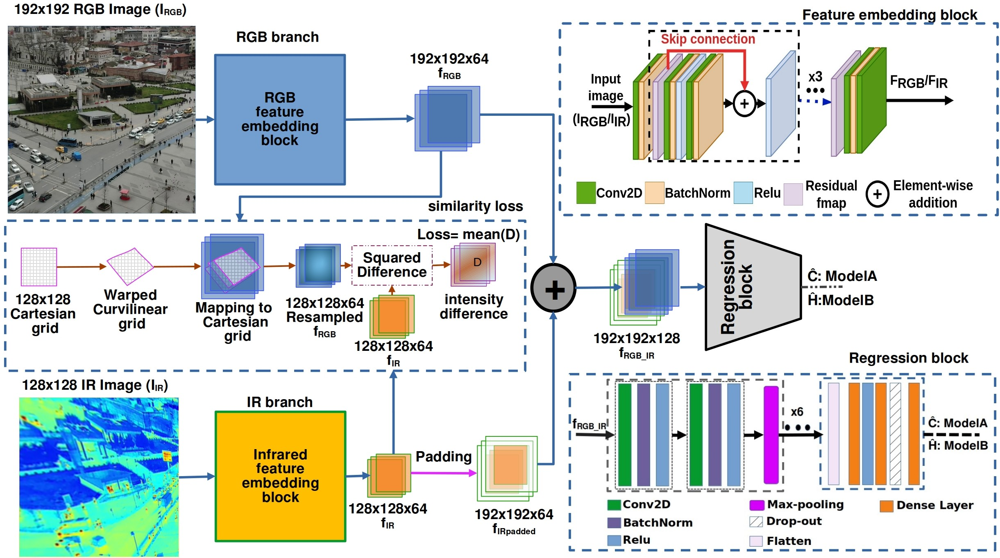
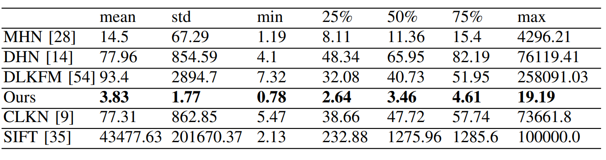
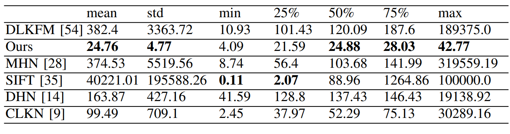
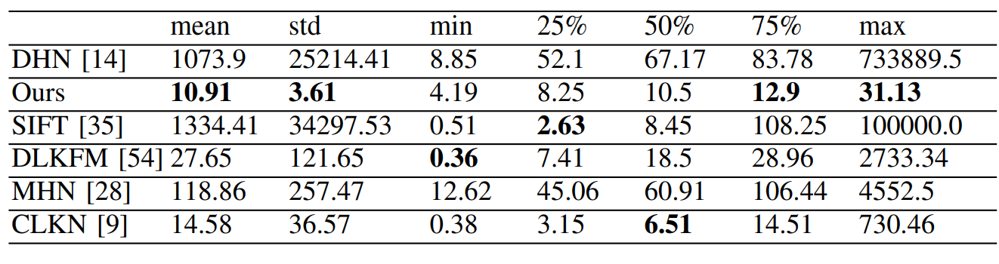
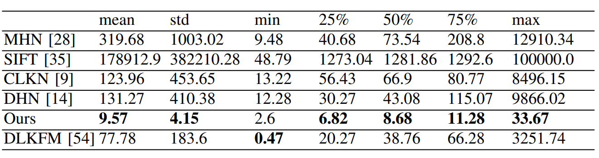
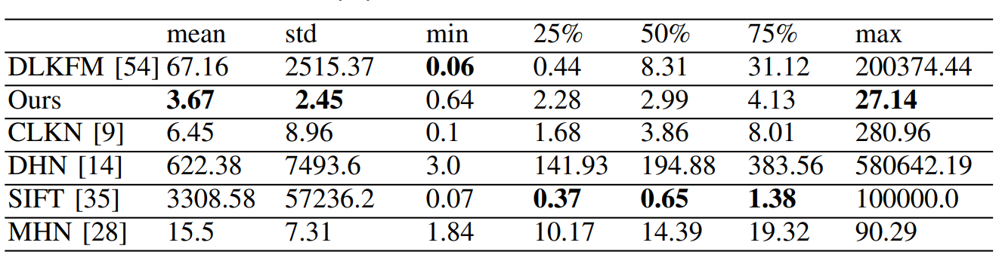
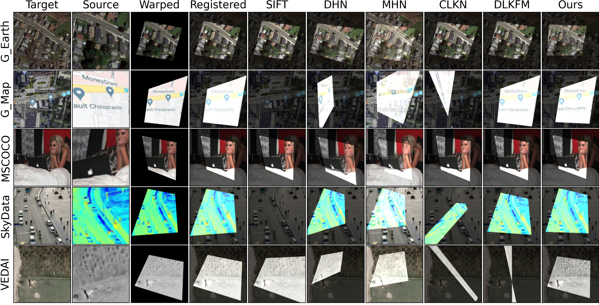

# VisIRNet

VisIRNet is a deep learning model designed for aligning visible and infrared image pairs captured by UAVs. This repository contains the code and resources used in the paper "[VisIRNet: Deep Image Alignment for UAV-Taken Visible and Infrared Image Pairs](https://ieeexplore.ieee.org/abstract/document/10440319)" published in IEEE Transactions on Geoscience and Remote Sensing.

## Table of Contents
- [Getting Started](#getting-started)
- [Usage](#usage)
- [Model](#model)
- [Results](#results)
- [Citations](#citations)
- [License](#license)


## Getting Started
### Steps
1. Clone the repository:
    ```bash
    git clone https://github.com/ozerlabs-proxy/VisIrNet.git
    cd VisIRNet
    ```
2. Create a virtual environment and activate it:
    ```bash
    conda create -n VisIrNet python==3.10
    conda activate VisIrNet
    ```
3. Install the required packages:
    ```bash
    pip install -r requirements.txt
    ```
### Data
1. create data under VisIrNet/
    ```bash
    mkdir data
    cd data
    ```
  
2. link datasets to data
    ```bash
    python ./scripts/link_datasets_to_data.py
    ```
    or manually

    ```bash
    cd data 
    ln -s ~/Datasets/GoogleEarth .
    ln -s ~/Datasets/MSCOCO .
    ln -s ~/Datasets/SkyData .
    ln -s ~/Datasets/VEDAI .
    ln -s ~/Datasets/GoogleMap .
    ```

## Usage
### Training

We did our experiments on a cluster of computers and GPUs with slurm. The scripts for training and inference are provided. The [configs](./configs/) folder includes configuration files for models, datasets, loss functions etc. Choose and provide the the configuration file to the training script (feel free to adjust them).


```bash
# train locally
conda activate VisIrNet
python Train.py --config-file >>>skydata_default_config.json<<<
```
OR
```bash
# train with slurm
sbatch slurm-training.sh
```
### Inference

```bash
#1. inference locally
conda activate VisIrNet
python Test.py --config-file skydata_default_config.json --r_loss_function  l2_corners_loss --b_loss_function ssim_pixel
```
OR 
```bash
#2. inference with slurm
sbatch slurm-inference.sh
```
### Visualize plots

visualize logs with tensorboard

```bash
# make sure conda env is activated
conda activate VisIrNet
tensorboard --logdir logs/tensorboard
```


## Model
The VisIRNet architecture is designed to handle the challenges of aligning visible and infrared images. Refer to the paper for detailed information about the model architecture and design choices.
<p align="center"></p>

## Experiments and Results

The model was trained and tested on the SkyData, VEDAI, Google Earth, Google Maps, and MSCOCO datasets. The results are presented in the paper. The following tables show the quantitative results for the SkyData, VEDAI, Google Earth, Google Maps, and MSCOCO datasets.

<div style="display: grid; grid-template-columns: repeat(2, 1fr); grid-gap: 5px;">
<div>

Backbone losses choice
- &check; mean_squared_error (mse_pixel) "l2"
- &check; mean_absolute_error (mae_pixel) "l1"
- &check; sum_squared_error (sse_pixel)
- &check; structural_similarity (ssim_pixel)
</div>
<div>

registration losses choice
- &check; l1_homography_loss
- &check; l2_homography_loss
- &check; l1_corners_loss
- &check; l2_corners_loss
</div>
<div>
Backbones with diferent losses and datasets

|           |SkyData    |VEDAI  |
|-----------|-----------|-------|
| mse_pixel | &check;       | &check;   | 
| mae_pixel | &check;       | &check;   |  
| sse_pixel | &check;       | &check;   |
| ssim_pixel| &check;       | &check;   | 
</div>
<div>
for each dataset there will be regression head trained on different backbones with different regression losses

| Backbone  | R_loss | SkyData    |VEDAI  |
|-----------|-----------------|-----------|-------|
| mse_pixel | l2_corners_loss | &check;       | &check;   | 
| mae_pixel | l2_corners_loss | &check;       | &check;   | 
| sse_pixel | l2_corners_loss | &check;       | &check;   | 
| ssim_pixel| l2_corners_loss | &check;       | &check;   |

</div>
</div>

### Quantitative Results

<div style="display: grid; grid-template-columns: repeat(3, 1fr); grid-gap: 10px;">
    <div style="border: 1px solid black; padding: 2px;">
        <p align="center" style="height: .8em;">SkyData</p>
                
    </div>
    <div style="border: 1px solid black; padding: 2px;">
        <p align="center" style="height: .8em;">VEDAI</p>
        
    </div>
    <div style="border: 1px solid black; padding: 2px;">
        <p align="center" style="height: .8em;">Google Earth</p>
        
    </div>
    <div style="border: 1px solid black; padding: 2px;">
        <p align="center" style="height: .8em;">Google Maps</p>
                
    </div>
    <div style="border: 1px solid black; padding: 2px;">
        <p align="center" style="height: .8em;">MSCOCO</p>
                
    </div>
</div>

### Qualitative Results
<p align="center"></p>

## Important Notebooks
- [Train Test Flow](notebooks/pipeline.ipynb)
- [Visualize backbones](notebooks/visualizeBackBoneRes.ipynb)


## Citations
If you use this code in your research, please cite our paper:
```bibtex
@article{ozer2024visirnet,
  title={VisIRNet: Deep Image Alignment for UAV-Taken Visible and Infrared Image Pairs},
  author={{\"O}zer, Sedat and Ndigande, Alain P},
  journal={IEEE Transactions on Geoscience and Remote Sensing},
  volume={62},
  pages={1--11},
  year={2024},
  publisher={IEEE}
}
```

## License
This project is licensed under the MIT License - see the [LICENSE](LICENSE) file for details.

---
